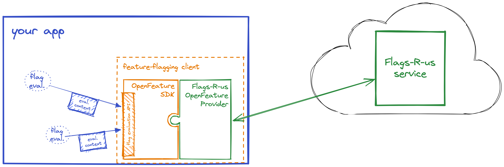

<!-- _footer: 'https://github.com/codebytes/feature-flags' -->


# Feature Flags
## The Art of the IF and Deployment

---


## Chris Ayers
### Senior Customer Engineer<br>Microsoft

<i class="fa-brands fa-twitter"></i> Twitter: @Chris\_L\_Ayers
<i class="fa-brands fa-mastodon"></i> Mastodon: @Chrisayers@hachyderm.io
<i class="fa-brands fa-linkedin"></i> LinkedIn: - [chris\-l\-ayers](https://linkedin.com/in/chris-l-ayers/)
<i class="fa fa-window-maximize"></i> Blog: [https://chris-ayers\.com/](https://chris-ayers.com/)
<i class="fa-brands fa-github"></i> GitHub: [Codebytes](https://github.com/codebytes)

---


# Agenda
- **What are Feature Flags?**
- **Why use Feature Flags?**
- **Operationalizing Flags**
- **Demos**
  
---

# What is a Feature Flag?

Feature Flags are also known as Feature Toggles.

Feature flags can be simple configuration settings with Boolean, string or other values.

---

<div class="columns">
<div>

# What Are Feature Flags?
Lets find out
- Booleans in the code
- Config values checked in

</div>
<div>
<br>
<br>

## Basics
```cs
bool featureFlag = true;
if (featureFlag) {
    // Run the following code
}
```
</div>
</div>

---

<div class="columns">
<div>

# What Are Feature Flags?
Dynamic toggling based on some information and rules

</div>
<div>
<br>
<br>

## Dynamic
```cs
bool featureFlag = isBetaUser();

if (featureFlag) {
    // Run the following code
}
```
</div>

</div>

---


# Why Use Feature Flags?

---

<div class="columns">
<div>

# Feature Flags have different uses

</div>
<div>

#### <i class="fa fa-users"></i> Minimize Disruption to Customers

#### <i class="fa fa-refresh"></i> Progressive / Incremental Rollouts
#### <i class="fa fa-flask"></i> A/B Testing - Hypothesis Driven Development
#### <i class="fa fa-ban"></i> Kill Switch
#### <i class="fa fa-calendar"></i> Calendar Events

</div>
</div>

---

<div class="columns">
<div>

# Feature Flags have different uses

</div>
<div>

#### <i class="fa fa-check-square-o"></i> Allow Users to Opt In
#### <i class="fa fa-users"></i> Block Users
#### <i class="fa fa-newspaper"></i> Subscriptions
#### <i class="fa fa-sliders"></i> Advanced Users
#### <i class="fa fa-wrench"></i> Maintenance Mode
#### <i class="fa fa-line-chart"></i> Load Management
#### <i class="fa fa-th-large"></i> Code Separation
#### <i class="fa fa-power-off"></i> Sunset / Shut Off

</div>
</div>

---

<div class="columns">
<div>

# Not all Flags are the same


</div>
<div>

## Short Term

- These are used to roll out new features or conduct experiments.  
- They can be found anywhere, and can be more complex. 
- They should be cleaned up after the rollout or experiment.

</div>

</div>

---
<div class="columns">
<div>

# Not all Flags are the same


</div>
<div>

## Long Term

- Features can start out as flags and become business rules.
- Feature flags can turn into *Operational Flags*.
- You can leverage patterns instead of just an ***if*** statement
    - Strategy Pattern
    - Visitor Pattern 
    - Command Pattern

</div>

</div>

---


# Operationalizing Flags

---

# Deployment vs Release

<div class="columns">
<div>

## Deploy
  - Low Risk\, repeatable and routine
  - Installed on Production
  - Doesn’t mean features are in use

</div>
<div>

## Release
  - Higher Risk
  - Business decision
  - Enables access to a feature
  - Allows experimentation

</div>

</div>

---

# Limit the Blast Radius of Change


---

# Its all about control

#### How do you turn it on and off?
  - Per checkin?
  - Per server?
  - Per user?
  - Dynamically?


---


# Flag Targeting

<br>
<br>

<style scoped>
table {
    width: 100%;
}
</style>

|Targeting|Percentages|Triggers
|-|-|-|
|	<i class="fa fa-clock-o"></i> Time<br><i class="fa fa-map-o"></i> Region<br><i class="fa fa-user-circle-o"></i> User Details|<i class="fa fa-percent"></i> 10%/90%<br><i class="fa fa-percent"></i> 50%/50%|<i class="fa fa-line-chart"></i> Rise in failures<br><i class="fa fa-bar-chart"></i> Load

---

# Feature Flag Downsides

- Feature Flags are Technical Debt As Soon as You Add Them
- As you add flags, it can be harder to support and debug the system.
https://github.com/launchdarkly/featureflags/blob/master/2%20-%20Uses.md

---

# Flag Best Practices

- Have a naming convention for short or long term flags
- Use meaningful names with long descriptions
- Have a central location for flags, one place to look at available flags
- The development team should share flags and configurations at the end of a sprint so that the right configuration is released.
- NEVER re-purpose a feature flag
- Deprecate unused features and their flags
  
---

# Knight Capital and Feature Flags

* In 2012, Knight Capital Group suffered a trading loss of $440 million in 45 minutes due to a software glitch.
* The glitch was caused by the release of new software code that was not fully tested before being deployed to production.
* The code included an old feature that had been previously disabled, but was inadvertently reactivated by the new release.

---

# DATA - SQL/JSON Models

- Be additive, never change existing fields
- If you have to remove a field, obsolete it until there is no possibility of rollback
- Separate the data model from the business logic

---

# Feature Flag Providers


<div class="columns">
<div>

- Azure App Configuration
- Launch Darkly
- Split
- Optimizely
- Molasses

</div>
<div>

- Flagship
- GrowthBook
- Apptimize
- Taplytics
- Harness

</div>

</div>
  
---

# OpenFeature

OpenFeature is an open standard for feature flag management. OpenFeature provides a unified API and SDK, with extensibility for open source and commercial offerings.

https://openfeature.dev/



---

# Demos

---

# Questions


---

# Resources

<div class="columns">
<div>

## Links

- [https://github.com/microsoft/FeatureManagement-Dotnet](https://github.com/microsoft/FeatureManagement-Dotnet)
- [https://docs.microsoft.com/en-us/azure/azure-app-configuration/](https://docs.microsoft.com/en-us/azure/azure-app-configuration/)
- [https://github.com/codebytes](https://github.com/codebytes)

</div>
<div>

## Follow Chris Ayers 

<i class="fa-brands fa-twitter"></i> Twitter: @Chris\_L\_Ayers
<i class="fa-brands fa-mastodon"></i> Mastodon: @Chrisayers@hachyderm.io
<i class="fa-brands fa-linkedin"></i> LinkedIn: - [chris\-l\-ayers](https://linkedin.com/in/chris-l-ayers/)
<i class="fa fa-window-maximize"></i> Blog: [https://chris-ayers\.com/](https://chris-ayers.com/)
<i class="fa-brands fa-github"></i> GitHub: [Codebytes](https://github.com/codebytes)

</div>

</div>

